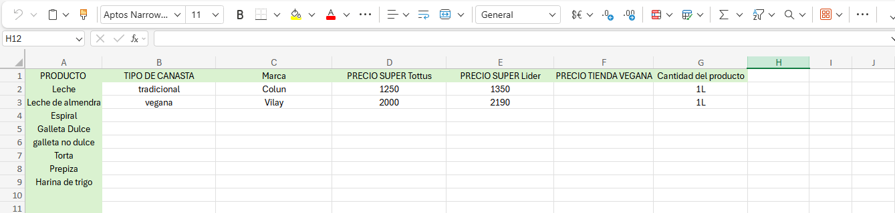

# Base de Datos
Crearemos una planilla de Excel con la recopilación de los productos de una canasta básica tradicional y los productos símil veganos, agregando sus precios de 2 diferentes supermercados y tiendas veganas. Además de incluir la categoría del tipo de canasta al que corresponde el producto en cuestión. Utilizaremos el informe de: Valor de la Canasta Básica de Alimentos y Líneas de Pobreza Informe Mensual, julio de 2025, de la Subsecretaría de Evaluación Social, Ministerio de Desarrollo Social y Familia de Chile.

 

Referencias: [La casa del Vegan](https://www.lacasadelvegan.cl/), [Líder](https://www.lider.cl/inicio) y [Tottus](https://www.tottus.cl/tottus-cl?srsltid=AfmBOoqFAzRfkP6UqOCHJ34k6PHIjSK1RQ9OekdIyPmPpUJ70pCK362i).
