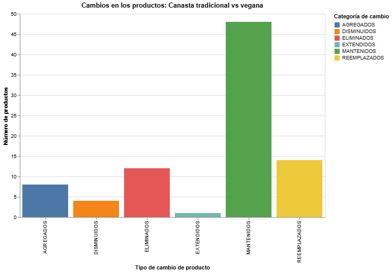

# Crónica de visualización

En un bosque lleno de senderos y sorpresas, Caperucita Roja llevaba su canasta vegana camino a la casa de la abuela, mientras que el lobo cargaba su canasta tradicional, llena de productos de origen animal. Cada paso de su camino se convirtió en una oportunidad para comparar las dos canastas y descubrir cómo se transformaría la alimentación si se adoptara una dieta vegana.

La visualización de datos muestra, como si fueran las paradas del camino, cómo los productos de la canasta tradicional del lobo se transforman al pasar a la versión vegana de Caperucita. Se identificaron seis tipos de cambios:

- **Mantenidos**: productos que permanecen iguales en ambas canastas. Son aquellos alimentos básicos que ambos llevan sin modificaciones, como frutas, verduras y algunos cereales.  
- **Reemplazados**: productos de la canasta del lobo sustituidos por alternativas vegetales en la canasta de Caperucita. Por ejemplo, chocolates o helados fueron reemplazados por su versión vegana.  
- **Eliminados**: productos que desaparecen en la canasta vegana porque no tienen sustituto directo, como pescados y mariscos.  
- **Agregados**: nuevos productos que solo aparecen en la canasta vegana de Caperucita, como proteínas vegetales o vegetales que no estaban considerados en la canasta tradicional del lobo.  
- **Extendidos**: un producto se divide en varios productos veganos. Por ejemplo, las legumbres secas del lobo se convierten en porotos, lentejas y garbanzos en la canasta de Caperucita.
- **Disminuidos**: varios productos se consolidan en uno solo. Por ejemplo, leche líquida y leche en polvo de la canasta del lobo se unifican en una sola opción de leche vegana para Caperucita.

A medida que avanzaban por el bosque, podían ver claramente cuál era el tipo de cambio más frecuente y cómo se distribuían los productos entre las distintas categorías. Si bien muchos productos se repetían en ambas canastas, notaron que muchos otros no eran simplemente reemplazados por una alternativa vegana, sino que eran eliminados o se reducían a un mismo producto. 

Así, Caperucita y el lobo se dieron cuenta que adaptar la canasta básica a un estilo de vida vegano implica no solo reemplazos directos, sino también reorganización de productos, agregando diversidad en algunas áreas y consolidando en otras. Este viaje por el bosque los ayudó a entender que el proceso de adaptación por el cual debe pasar la dieta de una persona que recién incursiona en el veganismo es mucho más complejo de lo que se imaginaron, ya que comprendieron qué productos representan mayores diferencias y cómo se mantiene la funcionalidad de la dieta básica sin perder variedad ni accesibilidad.

